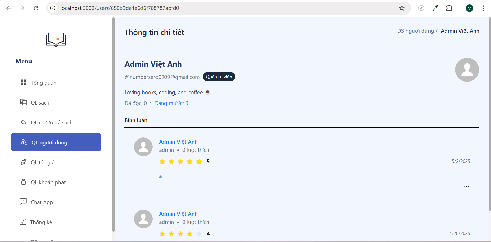

# 📚 Về dự án - Library management project - Vbrary

Một hệ thống quản lý thư viện giúp quản lý sách, độc giả, mượn trả sách giải quyết vấn đề bất cập khi quản lý thủ công thư viện

## 📌 I. Một số bài toán đã giải quyết

### 1. Thông báo người dùng khi sắp đến hạn trả sách

---

**Bài toán**
- Người dùng thường quên hạn trả sách, dẫn đến quá hạn và khó quản lý
- Cần một cơ chế **chủ động nhắc nhở** để giảm tình trạng trả sách trễ

**Giải pháp**
- Lưu thời điểm mượn và hạn trả sách trong collection `borrow_records`
- Cron job chạy định kỳ (hàng ngày):
  - Kiểm tra các bản ghi **sắp đến hạn trả** (ví dụ: còn 1–2 ngày)
  - Tự động gửi email nhắc nhở đến người dùng

**Luồng xử lý**
1. Cron job truy vấn các lượt mượn chưa trả
2. Lọc các bản ghi gần đến hạn
3. Gửi email thông báo qua Email Service
4. Đánh dấu đã gửi để tránh gửi trùng

**Lợi ích**
- Giảm số lượng sách trả trễ
- Nâng cao trải nghiệm người dùng
- Giúp thư viện quản lý mượn/trả hiệu quả hơn

---

## II. Tính năng chính
- Hỗ trợ gửi email khi người dùng quá hạn trả sách
- Quản lý sách (thêm, sửa, xoá, tìm kiếm)
- Quản lý người dùng (đăng ký, cập nhật thông tin, xoá)
- Quản lý mượn/trả sách
- Phân quyền theo loại người dùng (với 3 loại người dùng)
- Cung cấp một số thống kê dưới dạng số liệu và bảng biểu về tình hình thư viện: biến động mượn trả, thống kê sách theo lượt mượn
- Cung cấp 1 Chat App đơn giản
- Xác thực bằng JWT, refresh token
- Tải file .pdf, .xlsx


## 🛠️ III. Công nghệ nổi bật
    Frontend: Next.js, TypeScript, Tailwind CSS, Zustand, Ant Design, React Query
    Backend:  Node.js, Express.js, TypeScript, MongoDB

## 🎬 IV. Demo 

<table>
  <tr>
    <td></td>
    <td></td>
  </tr>
  <tr>
    <td></td>
    <td></td>
  </tr>
  <tr>
    <td></td>
    <td></td>
  </tr>
  <tr>
    <td></td>
    <td></td>
  </tr>
</table>

## V. Hướng dẫn cài đặt

### 1. Cài đặt Bun (bỏ qua nếu đã có Bun)

💻 **Nếu sử dụng macOS, Linux, hoặc WSL**

Dán dòng lệnh này vào terminal (macOS, Linux, hoặc WSL):

```bash
    curl -fsSL https://bun.sh/install | bash
```

💻 **Nếu là windows, dán dòng lệnh vào cmd:**
```bash
    powershell -c "irm bun.sh/install.ps1|iex"
```

Hoặc cài thông qua npm:
```bash
    npm install -g bun
```


### 2. Clone source code

```bash
  git clone https://github.com/helloVietTran/library-management-project
  cd library-management-project
```


### 3. Cài đặt thư viện và chạy backend
```bash
  cd backend
  npm install
  npm run dev
```


### 4. Cài đặt thư viện và chạy frontend
```bash
  cd frontend
  bun install
  bun run dev
```